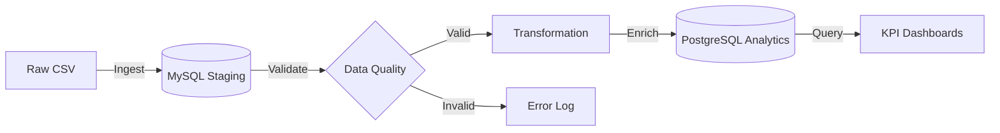

# Bangladesh Flight Price Pipeline


An Airflow data engineering pipeline designed to ingest, validate, transform, and analyze flight price data for the Bangladeshi aviation market. Orchestrated with **Apache Airflow**, this solution processes raw flight data to generate actionable insights on fare trends, seasonal variations, and route popularity.

## Key Features

- **Automated Ingestion**: Seamlessly loads raw CSV execution data into a MySQL staging environment.
- **Robust Validation**: Implements clear data quality checks (schema, types, nulls, business rules) with audit trails.
- **Advanced Analytics**: Computes complex KPIs including:
    - **Airline Pricing Strategy**: Average fares and tax breakdowns by airline.
    - **Seasonal Analysis**: Price fluctuations during peak (Eid, Winter) vs. off-peak seasons.
    - **Route Intelligence**: Identification of most popular and profitable routes.
- **Scalable Architecture**: Containerized with Docker Compose for consistent deployment across environments.

## 🏗️ Architecture

The pipeline follows a modern ELT (Extract, Load, Transform) pattern:



For a detailed technical deep-dive, please refer to the [Architecture Documentation](docs/ARCHITECTURE.md).

## Project Structure

```
flight-price-pipeline/
├── dags/                   # Airflow DAG definitions
├── plugins/                # Custom Airflow operators and sensors
├── src/                    # Core application logic (ETL, Validation)
├── sql/                    # Database initialization and KPI queries
├── docker/                 # Container orchestration configurations
├── docs/                   # Detailed project documentation
├── config/                 # Environment variables and app config
├── data/                   # Input datasets
└── logs/                   # Logs and reports
```

## Quick Start

### Prerequisites
- **Docker Desktop 29.1** 
- **Python 3.11** (util for key generation)

### Installation

1. **Clone the repository**
   ```bash
   git clone https://github.com/DE-E-K/DEM06_AIRFLOW.git
   cd DEM06_AIRFLOW
   ```

2. **Setup Configuration**
   Generate a Fernet key for Airflow security:
   ```bash
   python -c "from cryptography.fernet import Fernet; print(Fernet.generate_key().decode())"
   ```
   Update `config/.env` with the generated key and your secure credentials.

3. **Launch the Pipeline**
   ```bash
   docker compose --env-file config/.env up --build -d
   ```

4. **Access Interfaces**
   - **Airflow UI**: [http://localhost:8090](http://localhost:8090) (Default from environment: `admin` / `admin_password`)
   - **MySQL Staging**: `localhost:3308`
   - **PostgreSQL Analytics**: `localhost:5435`

## Pipeline Report Output

- A JSON execution report is generated by the `generate_report` task for each DAG run.
- Report files are written to `logs/reports/` in the project workspace.
- File name pattern: `flight_pipeline_report_<run_id>.json`.

## Documentation

- [Architecture Overview](docs/ARCHITECTURE.md) - System design and technology choices.
- [Setup Guide](docs/SETUP_GUIDE.md) - Detailed installation and troubleshooting.
- [DAG Explanations](docs/DAG_DOCUMENTATION.md) - Workflow logic and task breakdown.
- [KPI Definitions](docs/KPI_DEFINITIONS.md) - Business logic behind the metrics.
- [Database Interaction Guide](docs/DATABASE_INTERACTION.md) - How to connect, query, and validate data in MySQL and PostgreSQL.

## License

This project is licensed under the MIT License - see the [LICENSE](LICENSE) file for details.
