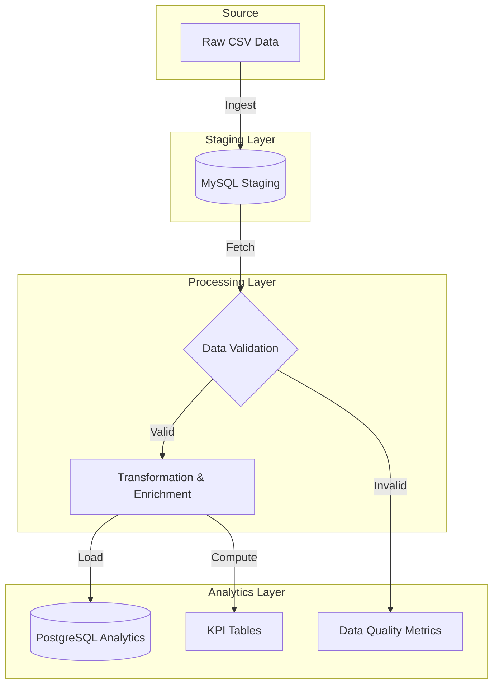

# 🏗️ Pipeline Architecture

## High-Level Overview

The **Bangladesh Flight Price Pipeline** is designed as a robust, scalable ELT (Extract, Load, Transform) solution. It orchestrates the flow of data from raw CSV files through staging, validation, and transformation layers to a final analytical store.

## Technology Stack

| Component | Technology | Version | Purpose |
|-----------|-----------|---------|---------|
| **Orchestration** | Apache Airflow | 2.7.3 | Workflow scheduling, dependency management, and monitoring. |
| **Staging DB** | MySQL | 8.0 | High-throughput ingestion of raw row-level data. |
| **Analytics DB** | PostgreSQL | 15 | Structured storage for enriched data and complex KPI queries. |
| **Processing** | Python | 3.10+ | Core logic for dataframes (Pandas), SQL interaction (SQLAlchemy), and validation. |
| **Containerization** | Docker | 24+ | Isolates services and ensures consistent environments. |

## Data Flow Detail

### 1. Ingestion (`ingest_to_staging`)
- **Mechanism**: Batch processing (1,000 rows/chunk).
- **Normalization**: Column headers are standardized (snake_case).
- **Metadata Injection**: Adds `source_filename`, `ingestion_timestamp`, and `record_status`.
- **Target**: MySQL `raw_flight_data`.

### 2. Validation (`validate_data`)
Implements a "Quality Gate" pattern. Records must pass 6 specific checks:
1.  **Schema Integrity**: Presence of all required columns.
2.  **Type Safety**: Numeric and string type enforcement.
3.  **Completeness**: Critical fields must not be NULL.
4.  **Business Logic**: No negative fares.
5.  **Referential Integrity**: (Optional) City whitelist check.
6.  **Mathematical Consistency**: `Total Fare (BDT)` ≈ `Base Fare (BDT)` + `Tax & Surcharge (BDT)`.

**Audit**: All results are logged to PostgreSQL `data_quality_metrics`.

### 3. Transformation (`transform_data`)
Enriches valid data for business insights:
- **Fare Reconstruction**: Auto-calculates `Total Fare (BDT)` if missing.
- **Data Standardization**: Title-casing cities, trimming whitespace.
- **Seasonality Logic**:
    - **PEAK_EID**: Modeled around Islamic lunar calendar (approx. dates).
    - **PEAK_WINTER**: Dec 1 - Jan 31.
    - **NON_PEAK**: Remainder of year.

### 4. KPI Computation (`compute_kpis`)
Aggregates data into business-ready metrics:

| Metric | logic | Target Table |
|--------|-------|--------------|
| **Airline Strategy** | Avg `Base`/`Total Fare (BDT)` per airline. | `kpi_airline_average` |
| **Seasonal Trends** | Price elasticity (Peak vs Non-Peak). | `kpi_seasonal_variation` |
| **Route Popularity** | Top 10 routes by booking volume. | `kpi_popular_routes` |

### 5. Loading (`load_to_postgres`)
- **Strategy**: Append-only for transaction logs; Upsert/Replace for current state KPIs.
- **Consistency**: Uses database transactions to ensure atomicity.

## Database Schema

### MySQL (Staging)
**Table**: `raw_flight_data`
- Optimized for write-speed.
- Stores raw strings/decimals to avoid ingestion failures on type mismatches.
- Includes `validation_errors` JSON column for debugging.

### PostgreSQL (Analytics)
**Schema**: Star-schema inspired design.
- **Fact Table**: `flights_enriched` (The source of truth).
- **Dimension/Aggr Tables**: `kpi_*` tables for fast dashboarding.
- **Audit Table**: `data_quality_metrics`.

## Error Handling & Resilience

- **Retry Policy**: 2 retries with exponential backoff (5m delay).
- **Circuit Breakers**: Pipeline halts if Data Validity < 90% (configurable).
- **Connection Reliability**: SQLAlchemy connection pooling with pre-ping validation.
- **Idempotency**: KPI calculations can be re-run safely without duplicating data.
